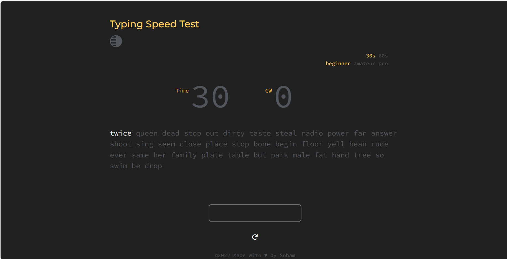

# WPM  - Words per Minute

This is a typing speed application which when used helps to identify the speed and the accuracy with which you type. You can converse with people more quickly the faster you type. You can quickly check your WPM and CPM typing scores with this free typing speed test project!

## Project Description.

> This project has 3 different levels - **Beginner**, **Amateur** & **Pro**. 

This is a time-bound evaluation of either 30s or 60s.

> Examine your typing speed over the three levels and make sure you're aiming for beginner-level accuracy in the pro stage. This fosters a competitive atmosphere and a drive to achieve notable accuracy and speed.